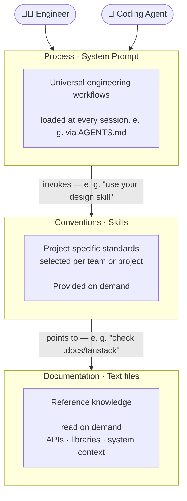

# ADE — Agentic Development Environment

> A technology-agnostic information architecture for coding agents that enables
> consistent, professional-grade agentic engineering at team scale.

## The alignment problem

The biggest challenge in agentic development is not agent capability — it is alignment.

An agent can write excellent code and still produce the wrong result, if it lacks
the right context. The human engineer had a goal in mind. The agent had a
different understanding of the problem. The output is technically correct but
misses the point entirely.

This is not a capability problem. It is an **information problem**.

## How professional engineers (should) work

Think about what distinguishes a senior engineer from a developer who jumps
straight to writing code. It is not just technical skill — it is a structured
way of thinking about problems.

A senior engineer working on a feature does not open an editor immediately. They
**explore** the problem space, **plan** an approach, **implement** incrementally,
and **commit** deliberate, well-scoped changes. Working on a bug, they first
**reproduce** it reliably, **analyze** the root cause, **fix** the right thing,
and **verify** the fix holds.

This process knowledge is partially taught, partially acquired through experience
— and, in practice, frequently skipped. Developers jump to conclusions. Agents
do the same.

Beyond process, every project carries **conventions**: the technology choices,
architectural patterns, design principles, and team agreements about _how_ to
solve problems in this specific context. You acquire this knowledge when you join
a new project, through code review, discussions with colleagues, and time.

And then there is **documentation**: the reference material you consult while
implementing — API details, library behavior, system specifications. You do not
memorize it. You look it up at the moment you need it.

Three distinct types of information. Three different acquisition modes. Three
different roles in the act of engineering.

## What ADE is

**ADE is an information architecture for agentic development.**

It provides a rigid, technology-agnostic structure that organizes the information
a coding agent needs into three explicit layers — each mapped to a concrete,
agent-native artifact type — and a mechanism to compose them.

### Why this is needed

There is no secret ingredient to interacting with coding agents. We just have to
instruct them properly. But this "properly" can be achieve in many ways.
Where do we put write down this steering? In the `AGENTS.md`? In Skills? Move it to a prompt,
potentially exposed by an MCP server? And how do we share it across team mates?
It has become good practice to check this into the repo, but honestly:

Most `AGENTS.md` files are snowflakes: ad-hoc, project-specific, unstructured.
They mix process instructions with coding conventions and documentation fragments
in a single flat file. Rule files and skills improve reusability but still lack a
coherent taxonomy.

ADE brings structure to this space. By separating the three layers explicitly and
binding each to a specific artifact type, it makes information easier to find,
easier to maintain, and — critically — easier for agents to apply in the right
context at the right moment.

The result is agents that behave predictably and professionally across your entire
team, regardless of who is running them.

## How the layers compose

The three layers are not independent — they reference each other in a deliberate
direction. Process invokes conventions. Conventions point to documentation.

**Process enforces workflows and delegates to skills:**

> _"When in the plan phase, use your `design` skill."_

The agent system prompt defines and enforces the workflow. At the right step, it
delegates to a skill that encodes the team&quot;s specific approach — keeping process
universal and conventions local.

**Skills reference documentation on demand:**

> _"We are using React with TanStack Query for backend interactions. Check_
> _`.docs/tanstack` when implementing data fetching. Check `.docs/components` for_
> _details on available reusable components."_

The skill encodes the convention — which libraries, which patterns. It surfaces
the exact documentation needed at the moment it is relevant, rather than loading
everything upfront.

This composability is what makes ADE scale. Process is written once and shared
across every project. Skills are curated per team or per project context — ADE
provides a mechanism to select and compose skill sets, so the right conventions
are available for the right context. Documentation lives where it belongs — in
the codebase — and is surfaced precisely when needed.

**Sounds intuitive?** Hopefully, it does. Because **this framework only works, if
you as human join the team**.

## What ADE includes

### Agent configurations that enforce workflows

An `AGENTS.md` (or equivalent) structured around universal engineering workflows.
It does not describe how the agent _could_ work — it enforces how the agent
_does_ work. Every task type has a defined process. The agent follows it.

This is the layer that transfers across every project without modification. It
encodes the professional engineering mindset as an explicit, shareable artifact.

### Skill sets — selectable and composable

Skills encode project-specific knowledge as reusable, invocable artifacts. They
capture technology choices, architectural patterns, and design decisions in a form
the agent applies on demand.

ADE provides a mechanism to select and share **skill sets** — curated collections
of skills that match a team&quot;s context. A frontend team, a backend team, and a
platform team each activate the skill set appropriate to their work. Skills can
be shared across projects, versioned, and evolved independently of the process
layer.

### Documentation sharing

Reference material committed to the repository and made available to agents
through structured references in skills. Agents do not load documentation
upfront — they are directed to specific docs at the moment they are relevant.

ADE defines conventions for organizing and pointing to documentation so that
skills across different projects follow consistent patterns for surfacing
reference knowledge.

### Coding agent agnostic setup tooling

ADE will :soon: include a simple cli to setup your coding agent. All configuration
can be placed into your repo, so that you can check it in.

We're using STDIO based MCP-servers to expose process guidance, conventions and docs
to coding agents. There are other proprietary ways to do this, but by using the
well-established Model Context Protocol which is optimized for discoverability, we
make sure that you get a similar experience, no matter whether you are using Claude
Code, Copilot or Kiro.

## Core principles

**Shared context over personal configuration.**
Agent configuration lives in the repository, not in individual developer
dotfiles. Every team member, every agent, every CI run operates from the same
information foundation.

**Structure over accumulation.**
Information is organized by type — process, conventions, documentation — not
accumulated into a single growing file. Structure makes information findable and
maintainable.

**Explicit process over implicit assumption.**
Agents follow defined workflows for defined task types. The process is enforced,
not suggested.

**Technology-agnostic by design.**
The information architecture is universal. The content adapts to each project and
stack. What transfers across projects is the structure itself.

## Customization

All artifacts, that are produced by the CLI, are by default adaptable: You can provide
own workflows, your own skills, your own docs. It should work out of the box.
If this is still too opinionated for you, you can swap out each layer.

After all: there is no secret ingredient, it only about getting relevant information
into the conversation context.
