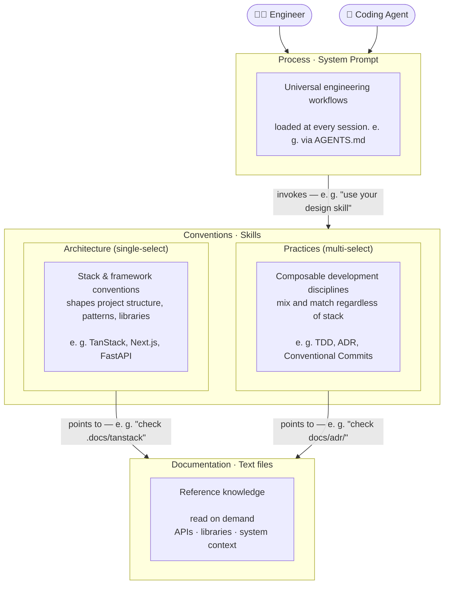

# ADE — Agentic Development Environment

> A structured information architecture for harness engineering — organizing what
> coding agents know into composable, team-shared layers.

**TL;DR** — Run `npx @codemcp/ade setup` in your project to get started.

## The alignment problem

The biggest challenge in agentic development is not agent capability — it is alignment.

An agent can write excellent code and still produce the wrong result, if it lacks
the right context. The human engineer had a goal in mind. The agent had a
different understanding of the problem. The output is technically correct but
misses the point entirely.

This is not a capability problem. It is an **information problem**.

## How professional engineers (should) work

Think about what distinguishes a senior engineer from a developer who jumps
straight to writing code. It is not just technical skill — it is a structured
way of thinking about problems.

A senior engineer working on a feature does not open an editor immediately. They
**explore** the problem space, **plan** an approach, **implement** incrementally,
and **commit** deliberate, well-scoped changes. Working on a bug, they first
**reproduce** it reliably, **analyze** the root cause, **fix** the right thing,
and **verify** the fix holds.

This process knowledge is partially taught, partially acquired through experience
— and, in practice, frequently skipped. Developers jump to conclusions. Agents
do the same.

Beyond process, every project carries **conventions**: the technology choices,
architectural patterns, design principles, and team agreements about _how_ to
solve problems in this specific context. You acquire this knowledge when you join
a new project, through code review, discussions with colleagues, and time.

And then there is **documentation**: the reference material you consult while
implementing — API details, library behavior, system specifications. You do not
memorize it. You look it up at the moment you need it.

Three distinct types of information. Three different acquisition modes. Three
different roles in the act of engineering.

## What ADE is

**ADE is an information architecture for agentic development.**

It provides a rigid, technology-agnostic structure that organizes the information
a coding agent needs into three explicit layers — each mapped to a concrete,
agent-native artifact type — and a mechanism to compose them.

### Why this is needed

There is no secret ingredient to interacting with coding agents. We just have to
instruct them properly. The emerging practice of
[harness engineering](https://www.humanlayer.dev/blog/skill-issue-harness-engineering-for-coding-agents)
— leveraging agent configuration points to improve output quality and
reliability — has shown that most agent failures are configuration problems, not
capability problems. But _how_ do you configure well?

Where do you write down the steering? In the `AGENTS.md`? In skills? Move it to
a prompt, potentially exposed by an MCP server? And how do you share it across
team mates? It has become good practice to check this into the repo, but
honestly:

Most `AGENTS.md` files are snowflakes: ad-hoc, project-specific, unstructured.
They mix process instructions with coding conventions and documentation fragments
in a single flat file. Rule files and skills improve reusability but still lack a
coherent taxonomy. The ETH Zurich study on agentfiles confirmed what
practitioners already knew: LLM-generated ones hurt performance, bloated ones
waste instruction budget, and codebase overviews add nothing — agents discover
repository structure on their own.

ADE brings structure to this space. By separating the three layers explicitly and
binding each to a specific artifact type, it makes information easier to find,
easier to maintain, and — critically — easier for agents to apply in the right
context at the right moment.

The result is agents that behave predictably and professionally across your entire
team, regardless of who is running them.

## How the layers compose

The three layers are not independent — they reference each other in a deliberate
direction. Process invokes conventions. Conventions point to documentation.

**Process enforces workflows and delegates to skills:**

> _"When in the plan phase, use your `design` skill."_

The agent system prompt defines and enforces the workflow. At the right step, it
delegates to a skill that encodes the team's specific approach — keeping process
universal and conventions local.

**Conventions come in two flavours — architecture and practices:**

The conventions layer is split into two complementary sub-categories that reflect
how teams actually think about project-level decisions:

- **Architecture** (single-select) — Stack and framework conventions that shape
  your project structure, patterns, and libraries. You pick one architecture
  (e.g. TanStack, Next.js, FastAPI) and it constrains everything downstream.

  > _"We are using React with TanStack Query for backend interactions. Check_
  > _`.docs/tanstack` when implementing data fetching."_

- **Practices** (multi-select) — Composable development disciplines that apply
  regardless of your stack. You can combine TDD, ADR, and Conventional Commits
  freely — they are orthogonal to each other and to your architecture choice.

  > _"Use London-style TDD. Follow the Red-Green-Refactor cycle. Write ADRs for_
  > _significant decisions."_

**Skills reference documentation on demand:**

The skill encodes the convention — which libraries, which patterns. It surfaces
the exact documentation needed at the moment it is relevant, rather than loading
everything upfront.

This composability is what makes ADE scale. Process is written once and shared
across every project. Convention skills — both architecture and practices — are
curated per team or per project context. ADE provides a mechanism to select and
compose them, so the right conventions are available for the right context.
Documentation lives where it belongs — in the codebase — and is surfaced
precisely when needed.

**Sounds intuitive?** Hopefully, it does. Because **this framework only works, if
you as human join the team**.

## What ADE includes

### Agent configurations that enforce workflows

An `AGENTS.md` (or equivalent) structured around universal engineering workflows.
It does not describe how the agent _could_ work — it enforces how the agent
_does_ work. Every task type has a defined process. The agent follows it.

This is the layer that transfers across every project without modification. It
encodes the professional engineering mindset as an explicit, shareable artifact.

### Skill sets — selectable and composable

Skills encode project-specific knowledge as reusable, invocable artifacts. They
capture technology choices, architectural patterns, and design decisions in a form
the agent applies on demand.

ADE provides a mechanism to select and share **skill sets** — curated collections
of skills that match a team's context. Within the conventions layer, skills are
organized into two sub-categories:

- **Architecture** (single-select) — Stack and framework conventions that shape
  your project structure. You pick one (e.g. TanStack, Next.js, FastAPI) and it
  constrains patterns, libraries, and project organization.

- **Practices** (multi-select) — Composable development disciplines that apply
  regardless of your stack. TDD, ADR, Conventional Commits — mix and match
  freely.

A frontend team, a backend team, and a platform team each activate the
combination appropriate to their work. Skills can be shared across projects,
versioned, and evolved independently of the process layer.

### Documentation sharing

Reference material committed to the repository and made available to agents
through structured references in skills. Agents do not load documentation
upfront — they are directed to specific docs at the moment they are relevant.

ADE defines conventions for organizing and pointing to documentation so that
skills across different projects follow consistent patterns for surfacing
reference knowledge.

### Coding agent agnostic setup tooling

ADE includes a CLI with two commands that cover distinct concerns:

- **`ade setup`** — define your team's development choices (process, architecture,
  practices, backpressure). Writes `config.yaml` and `config.lock.yaml` into your
  repo so the whole team works from the same foundation.

- **`ade configure`** — configure your coding agent (autonomy profile, target
  harness, skills). This is developer/environment-level and intentionally
  ephemeral — not stored in shared config files.

We use STDIO-based MCP servers to expose process guidance, conventions, and docs
to coding agents. By using the Model Context Protocol — optimized for
discoverability — you get a consistent experience regardless of your agent.

The CLI supports a growing list of agents. See the
[harness writers source](packages/harnesses/src/writers) for the current set.

## Where ADE fits in harness engineering

A coding agent's harness has many configuration levers. ADE addresses the
**information levers** — the ones that determine _what the agent knows_:

| Harness lever                | ADE layer         | Artifact                          |
| ---------------------------- | ----------------- | --------------------------------- |
| System prompt / agentfile    | **Process**       | `AGENTS.md`                       |
| Skills / instruction modules | **Conventions**   | Skills (architecture + practices) |
| Reference knowledge          | **Documentation** | Text files, read on demand        |

Practitioners have identified additional **runtime levers** that complement the
information architecture:

- **Sub-agents** — context firewalls that encapsulate discrete tasks in isolated
  context windows, preventing intermediate noise from accumulating in the parent
  thread. This keeps the orchestrating agent in the "smart zone" and enables
  coherent work across many sessions.

- **Hooks** — user-defined scripts triggered at lifecycle events (tool calls,
  stop events) that add deterministic control flow: auto-approving or denying
  dangerous commands, surfacing build errors before the agent finishes, or
  notifying the team on completion.

- **Back-pressure** — verification mechanisms (typechecks, tests, coverage
  gates) that let the agent check its own work. The likelihood of successfully
  solving a problem with a coding agent is strongly correlated with the agent's
  ability to verify its output. Context-efficient verification — where success is
  silent and only failures surface — keeps the context window clean.

ADE focuses on the information side because that is where most teams struggle
first: without a coherent taxonomy, every project re-invents its agentfile from
scratch. The runtime levers are powerful complements — and ADE's process layer
can reference them (e.g. _"delegate research to a sub-agent"_, _"verify with the
build hook before committing"_) — but they are orthogonal to the information
architecture itself.

## Core principles

**Shared context over personal configuration.**
Agent configuration lives in the repository, not in individual developer
dotfiles. Every team member, every agent, every CI run operates from the same
information foundation.

**Structure over accumulation.**
Information is organized by type — process, conventions, documentation — not
accumulated into a single growing file. Structure makes information findable and
maintainable.

**Explicit process over implicit assumption.**
Agents follow defined workflows for defined task types. The process is enforced,
not suggested.

**Technology-agnostic by design.**
The information architecture is universal. The content adapts to each project and
stack. What transfers across projects is the structure itself.

## Customization

All artifacts produced by the CLI are adaptable: you can provide your own
workflows, your own skills, your own docs. It should work out of the box. If
this is still too opinionated for you, you can swap out each layer.

Bias towards shipping. Start simple and add configuration only when the agent
actually fails — then engineer a solution so it does not fail that way again.
The goal is not the ideal harness; it is shipping high-quality code faster.

After all: there is no secret ingredient. It is only about getting relevant
information into the conversation context.

## Further reading

- [Skill Issue: Harness Engineering for Coding Agents](https://www.humanlayer.dev/blog/skill-issue-harness-engineering-for-coding-agents)
  — HumanLayer's practical guide to harness engineering, covering skills,
  sub-agents, hooks, and back-pressure mechanisms.
